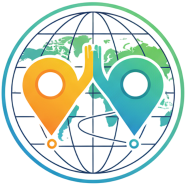
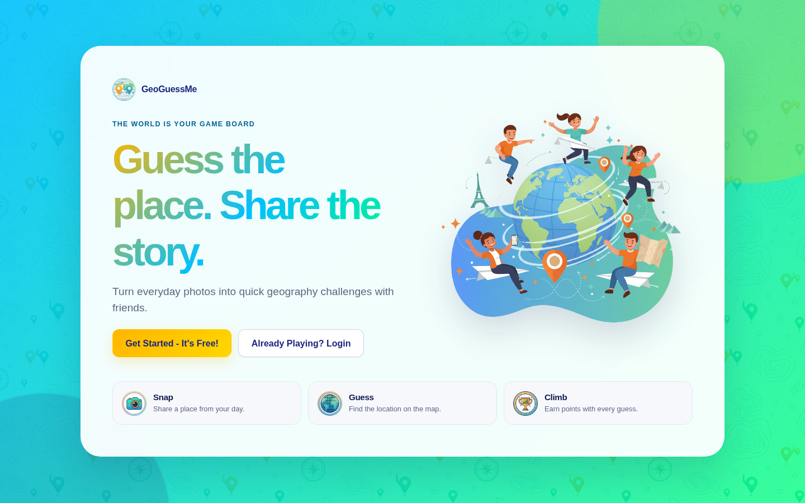
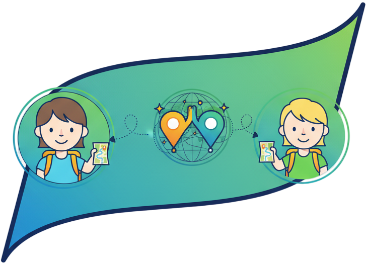
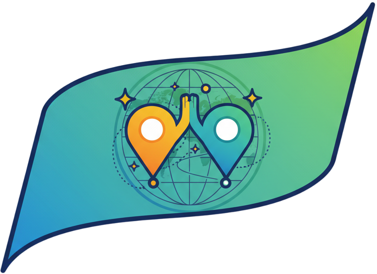
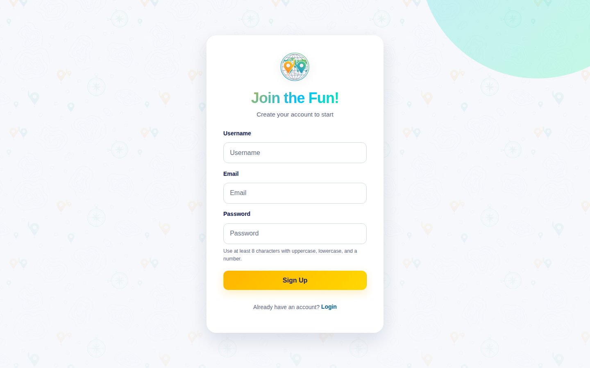

# GeoGuessMe

<div align="center">
  
  <h2>Guess the place. Share the story. 🌍</h2>
  <p>Turn everyday photos into quick, friendly geography challenges.</p>
  <p>
    <a href="https://geoguessme.com"><strong>🎮 Play GeoGuessMe</strong></a>
    ·
    <a href="docs/gameplay.md">📖 How the game works</a>
    ·
    <a href="CONTRIBUTING.md">🤝 Contribute</a>
  </p>
</div>

<p align="center">
  <a href="https://github.com/Anko59/GeGuessMe/actions/workflows/ci.yml?query=branch%3Adev"></a>
  <a href="LICENSE"></a>
  <a href="docs/testing.md"></a>
</p>

<p align="center">
  
</p>

## 🧭 Welcome to GeoGuessMe

GeoGuessMe is a multiplayer location game for the moments that deserve a story.
Create a private group, send a photo or video challenge, and let your friends
guess where it was taken. Every guess becomes part of the group’s leaderboard.

The app is a responsive, installable web app: open
**[geoguessme.com](https://geoguessme.com)** in a browser, or add it to your
phone’s home screen for a more app-like experience. No native install is
required.

## 🎥 See it in action

<p align="center">
  <video controls muted loop playsinline poster="docs/assets/geoguessme-home.png" width="900">
    <source src="docs/assets/geoguessme-demo.webm" type="video/webm" />
    <a href="docs/assets/geoguessme-demo.webm">▶️ Watch the GeoGuessMe demo</a>
  </video>
</p>

The screenshots and walkthrough above are captured from the running app. The
illustrations below are part of GeoGuessMe’s own visual language.

<p align="center">
  
  
</p>

<table>
  <tr>
    <td width="50%"></td>
    <td width="50%"><strong>Ready for your group?</strong><br /><br />Create an account, invite friends with a private group code, and start sending places worth guessing.</td>
  </tr>
</table>

## 🎮 How a round works

1. **Create or join a group.** Share the group code or invite link with your
   friends.
2. **Capture a moment.** Send a photo or a short video from the camera, with
   optional face-tracking lenses and banners.
3. **Accept the challenge.** Each member gets a server-controlled viewing window
   for the media.
4. **Drop a pin.** Place one guess on the map before the challenge expires.
5. **Compare the results.** See the distance, score, actual location, and the
   group leaderboard when results are available.

## ✨ What you can do

- **Challenge your people** with private, short-lived photo and video prompts.
- **Keep the conversation moving** with messenger-style hidden message actions,
  emoji reactions, and replies.
- **Make groups feel like yours** with a group photo and independent
  notification settings for every group.
- **Have fun with the camera** using on-device face tracking, playful lenses,
  editable text banners, and press-and-hold video capture.
- **Play fairly** with server-timed viewing windows, one guess per challenge,
  distance-based scoring, and resolved challenge states.
- **Stay in the loop** with installable PWA support and optional Web Push
  notifications.

<details>
<summary><strong>🔐 Privacy and retention</strong></summary>

Camera frames and selected media stay in the browser until you choose to send
them. Challenge media is stored privately, is available only to authorized group
members during the relevant viewing window, and is removed according to the
configured retention policy. See
[Security and privacy](docs/security-and-privacy.md) and
[Gameplay](docs/gameplay.md) for the full contract.

</details>

## 🛠️ Developer quick start

The supported host prerequisites are **Git, Make, Docker, and Docker Compose**.
Go, Node, npm, Playwright, linters, formatters, and migration tools run inside
the repository’s pinned Docker containers.

<details open>
<summary><strong>🚀 Start the local app</strong></summary>

```bash
make bootstrap
make dev
```

Open [http://localhost:5173](http://localhost:5173). The local stack includes
the Vite frontend, Go backend, PostgreSQL, MinIO-compatible media storage, and
Mailpit. Use `make status`, `make logs`, and `make down` to manage it.

</details>

<details>
<summary><strong>✅ Run the checks</strong></summary>

Use the smallest relevant gate while iterating, then run the full fast gate
before opening a pull request:

```bash
make format-check
make test-unit
make preflight
```

Useful focused targets include `make test-backend`, `make test-frontend`,
`make test-integration`, `make test-e2e`, and `make lint-docs`. The complete
release gate is `make verify`; it is run on the exact merged `dev` revision
before development images are published.

</details>

<details>
<summary><strong>🧱 Understand the stack</strong></summary>

| Layer    | Implementation                                                                        |
| -------- | ------------------------------------------------------------------------------------- |
| Web app  | React, TypeScript, Vite, responsive CSS, and PWA assets                               |
| Camera   | Browser media APIs, MediaPipe Face Landmarker, and Three.js lenses                    |
| API      | Go HTTP and WebSocket services with embedded ordered SQL migrations                   |
| Data     | PostgreSQL for accounts, groups, chat, challenges, guesses, and sessions              |
| Media    | Private S3-compatible storage; MinIO locally and Cloudflare R2 in hosted environments |
| Delivery | Caddy, Docker Compose, Cloudflare Tunnel, and immutable signed images                 |

The main code lives in [`frontend/`](frontend/), [`backend/`](backend/),
[`deployment/`](deployment/), and [`docs/`](docs/). The
[architecture guide](docs/architecture.md) explains trust boundaries and request
flows.

</details>

<details>
<summary><strong>🌿 Branches, pull requests, and releases</strong></summary>

- Start feature branches from `dev` and target pull requests to `dev`.
- Run `make hooks-install` and `make hooks-check`; never bypass the hooks.
- Add regression coverage for every behavior change and keep the working tree
  clean at handoff.
- Production releases use a short-lived repository `release/*` branch based on
  `main`. Its tree must exactly match the successfully deployed `dev` tree.
- Merges publish signed, immutable development images first. Production then
  promotes those exact image digests without rebuilding them.

See [Contributing](CONTRIBUTING.md), [Testing](docs/testing.md), and the
[hosted deployment runbook](docs/runbooks/hosted-deployment.md) before working
on CI or infrastructure.

</details>

## 📚 Find your way around

| If you want to…             | Start here                                                                    |
| --------------------------- | ----------------------------------------------------------------------------- |
| Play the game               | [geoguessme.com](https://geoguessme.com)                                      |
| Learn the rules             | [Gameplay](docs/gameplay.md)                                                  |
| Run it locally              | [Local development](docs/local-development.md)                                |
| Understand the system       | [Architecture](docs/architecture.md)                                          |
| Use the API                 | [API reference](docs/api.md) and [OpenAPI contract](docs/openapi.yaml)        |
| Test a change               | [Testing guide](docs/testing.md)                                              |
| Deploy or operate it        | [Deployment guide](deployment/README.md) and [Operations](docs/operations.md) |
| Review privacy and security | [Security and privacy](docs/security-and-privacy.md)                          |

The complete documentation map is in [`docs/index.md`](docs/index.md). Run
`make help` to see every supported Dockerized workflow.

## 🤝 Contributing

Bug reports, ideas, documentation improvements, and code contributions are
welcome. Please read [`CONTRIBUTING.md`](CONTRIBUTING.md) first. For a security
issue, follow the private reporting instructions in [`SECURITY.md`](SECURITY.md)
instead of opening a public issue.

## 📄 License

GeoGuessMe is released under the [MIT License](LICENSE).
